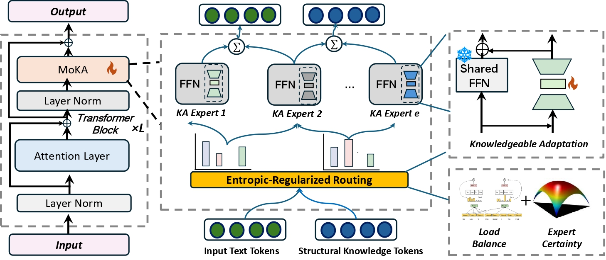

# MoKA

MoKA: Enhancing Large Language Models Fine-Tuning with Mixture of Knowledgeable Adaptations

------

## 🌈 Model Architecture



## 🔬 Preparation

1. Install the corresponding environment.

```
conda create -n moka python=3.10
conda activate moka
pip install -r requirements.txt
```

2. Download the corresponding Llama2-7B weights, and place our `llama_modeling.py` and `config.json` in the folder.
2. Download the datasets from [here](https://huggingface.co/luoxindi/data/tree/main). Download the KG configurations from [here](https://huggingface.co/luoxindi/kgs/tree/main), and move them under the `data` folder. Both the dataset and knowledge graph configuration are collated by the [KnowLA](https://arxiv.org/pdf/2403.14950) .

## :book:Training & Test

1. Train MoKA:

```bash
python finetune_kg.py \
    --base_model='/llama2_7B' \
    --num_epochs=3 \
    --cutoff_len=512 \
    --group_by_length \
    --output_dir='./llama2-lora-moka' \
    --lora_target_modules='[q_proj,k_proj,v_proj,o_proj]' \
    --lora_r=16 \
    --micro_batch_size=4
```

2. Test csqa/siqa for MoKA:

```bash
python test_csqa.py \
    --base_model='/llama2_7B' \
    --is_KG=True \
    --lora_weights="./llama2-lora-moka" \
    --dataset="csqa"
```

3. Test other tasks for MoKA:

```bash
python test_*.py \
    --base_model='/llama2_7B' \
    --is_KG=True \
    --lora_weights="./llama2-lora-moka" \
```

 test.py can be replaced by any test file such as test_wqsp.py.

## ⚠️Notice

1. Ensure that the PEFT version is 0.3.0.dev0; otherwise, the model weights may not be saved correctly.
2. We use `shutil.copyfile` to overwrite `modeling_llama.py` and `config.json` in the Conda environment, which will modify the original Transformers library.
3. All training and evaluation were conducted on H20-NVLink.